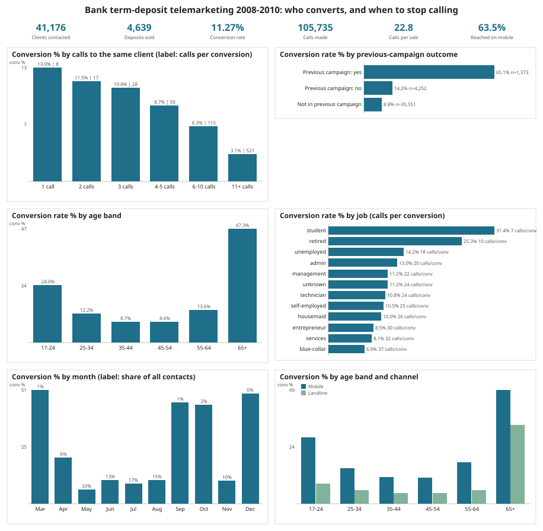
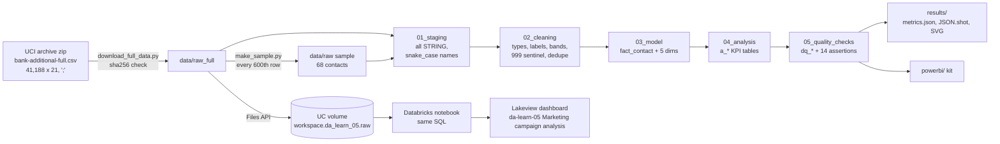

# da-learn-05 - Marketing campaign analysis (UCI Bank Marketing)

A data analyst learning project: take the **real telemarketing campaign of a Portuguese bank (41,188 client contacts,
May 2008 - Nov 2010, selling term deposits)**, clean it with numbered SQL scripts, model it as a star schema and answer
the campaign-manager questions: **which clients convert, through which channel and when, and at what point extra calls
stop paying off?** The same Spark-dialect SQL runs locally on DuckDB (full data) and on Databricks SQL (Unity Catalog +
a published Lakeview dashboard). A Power BI kit and SVG charts are included.



## Business questions
1. Which client **segments** (age, job, education, marital status, existing loans) convert best, and how many calls does one sale cost in each?
2. **Diminishing returns:** how does conversion change with the number of calls made to the same client in this campaign?
3. Does the **previous campaign outcome** predict this one?
4. **Timing and channel:** which months and weekdays work, and does mobile beat landline?
5. **Economic context:** how does conversion move with the 3-month Euribor rate and employment at contact time?
6. Which **job x age** segments should be called first?

Definitions: *conversion* = `y = 'yes'` (client subscribed a term deposit). The source has no money columns, so the
**cost proxy is effort**: `calls_per_conversion = SUM(calls made in the campaign) / conversions`. `duration` (last call
length) is only known after the call, so it is used for descriptive talk-time only, never for targeting.

## Pipeline


## Key insights (full data, DuckDB = Databricks)
- **11.27% of 41,176 clients converted** (4,639 deposits) after **105,735 calls**, i.e. **22.8 calls per sale** on average.
- **Stop calling after 3 attempts.** Conversion falls from **13.04% on the first call** to 10.75% (3 calls), 6.32% (6-10) and **3.11% (11+)**. Calls per sale rise from **7.7 to 114.9 (6-10 calls) and 521 (11+)**: clients called 6+ times absorbed **30.6% of all calls for 4.0% of sales**.
- **Previous success is the best single signal:** clients who said yes in the previous campaign converted at **65.11%** (2.8 calls per sale) vs **8.83%** for clients never contacted before.
- **The extremes of age convert best:** **65+ at 47.28%** and **17-24 at 23.99%** vs 8.6-8.7% for 35-54. By job, **students 31.43%** and **retired 25.26%** vs blue-collar 6.90% (37 calls per sale).
- **Mobile beats landline 14.74% vs 5.23%** (16.3 vs 54.5 calls per sale) in every age band.
- **Timing / economy:** May carried **33.4% of all contacts but converted only 6.44%**, while Mar, Sep, Oct and Dec converted 44-51% on <2% of volume each. Conversion is **45.72% when the 3-month Euribor was below 1%** vs 3.96-5.58% above 4% (the 2010 low-rate period).

Full tables and caveats: [results/RESULTS.md](results/RESULTS.md).

## How to run
```bash
pip install -r requirements.txt
python scripts/download_full_data.py      # 5.8 MB into data/raw_full/ (sha256-checked)
python run_pipeline.py --source full      # sql/00-05 on DuckDB -> results/, data/clean_full/
python run_pipeline.py --source sample --no-charts   # committed 68-row sample -> powerbi/data, results/sample/
python scripts/build_databricks.py --with-dashboard  # regenerate the notebook + .lvdash.json
```
Databricks: see [databricks/SETUP.md](databricks/SETUP.md) (upload the CSV to `/Volumes/workspace/da_learn_05/raw/`,
import the notebook, Run all, import the dashboard). Power BI: [powerbi/BUILD_GUIDE.md](powerbi/BUILD_GUIDE.md).

## Repository layout
```
sql/00_duckdb_compat.sql     DuckDB-only shims for Spark functions (datediff, percentile, ...)
sql/01_staging.sql           raw ';' CSV -> stg_contacts (21 columns, all STRING, dotted names -> snake_case)
sql/02_cleaning.sql          cln_contacts: typed, labelled, deduped, contact_id, bands + flags
sql/03_model.sql             fact_contact, dim_client, dim_period, dim_channel, dim_prev_campaign, dim_economy
sql/04_analysis.sql          a_* KPI tables (segments, calls, previous outcome, month, weekday, channel, economy, targeting)
sql/05_quality_checks.sql    dq_row_counts, dq_null_rates, dq_issues, dq_assertions
run_pipeline.py              DuckDB runner (+ pipeline.json config)
scripts/                     download, sample, charts (svgcharts.py), Databricks notebook/dashboard builders
data/raw/                    reproducible sample (68 contacts) - see data/README.md
databricks/                  exported notebook, .lvdash.json, run outputs, DuckDB vs Databricks comparison
powerbi/                     star-schema CSVs (sample), measures.dax, model.md, dashboard_spec.md, BUILD_GUIDE.md
results/                     RESULTS.md, metrics.json, JSON.shot, charts/*.svg, sample/JSON.shot
```

## Data quality summary
41,188 raw rows -> 41,176 clean (12 exact duplicate records collapsed; the file has no client id, so a deterministic
`contact_id` is assigned). `unknown` is kept as its own category: credit default 20.88%, education 4.20%, housing /
personal loan 2.40%, job 0.80%. `pdays = 999` (never contacted before, 96.32%) becomes NULL. 869 clients called more
than 10 times are flagged, not removed. All 14 assertions PASS on DuckDB and Databricks (the 68-row sample fails only
"one call converts better than 6+ calls", which needs volume).

## Limitations
- One bank, one product, 2008-2010; the low-rate months are also low-volume months, so month and Euribor effects are confounded.
- No costs or deposit amounts: ROI is approximated by calls per conversion.
- `campaign` counts calls in this campaign including the last one; rates are descriptive, not a propensity model.

## Complete dataset
| | |
|---|---|
| Kaggle page | https://www.kaggle.com/datasets/henriqueyamahata/bank-marketing ("Bank Marketing", copy of the UCI dataset) |
| Mirror URLs | https://archive.ics.uci.edu/static/public/222/bank+marketing.zip (official UCI archive, primary; file is `bank-additional.zip` -> `bank-additional/bank-additional-full.csv`), https://raw.githubusercontent.com/selva86/datasets/master/bank-additional-full.csv (fallback) - byte-identical, sha256 `74adfc578bf77a7ff4bb1ba4a9f8709d9e3c6907342959c2c8416847e0afb4d8` |
| Licence | CC BY 4.0 (UCI Machine Learning Repository). Cite: S. Moro, P. Cortez, P. Rita (2014), "A Data-Driven Approach to Predict the Success of Bank Telemarketing", Decision Support Systems 62:22-31 |
| Total size | 5,834,924 bytes (1 CSV, `;`-delimited, CRLF), 41,188 rows x 21 columns; UCI zip 1,023,843 bytes |
| File list | `bank-additional-full.csv` (age, job, marital, education, default, housing, loan, contact, month, day_of_week, duration, campaign, pdays, previous, poutcome, emp.var.rate, cons.price.idx, cons.conf.idx, euribor3m, nr.employed, y); the UCI zip also holds the 10% subset `bank-additional.csv` and the older 17-column `bank.zip`, not used |
| Download | `pip install -r requirements.txt && python scripts/download_full_data.py` |
