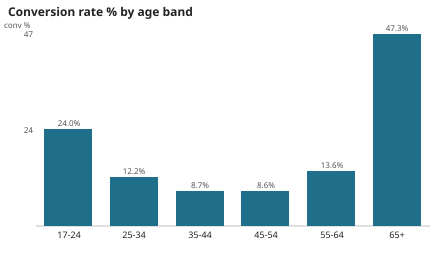
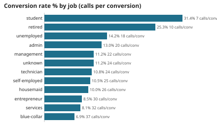
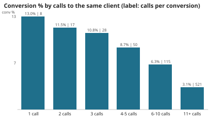
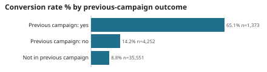
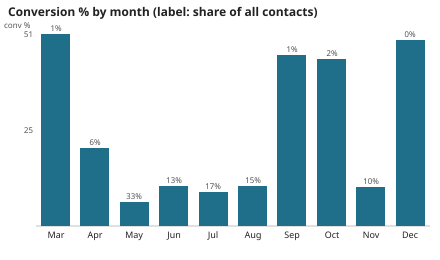
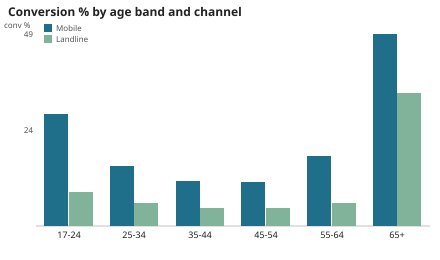
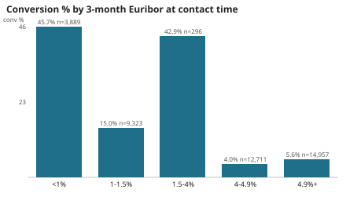

# Results - da-learn-05 Marketing campaign analysis

All numbers come from the **full** UCI Bank Marketing file (`bank-additional-full.csv`, 41,188 rows -> 41,176 clean
contacts) run through `sql/01-05` on DuckDB, and were reproduced on Databricks SQL (Serverless Starter Warehouse,
schema `workspace.da_learn_05`): see `databricks/run_outputs/duckdb_vs_databricks.json`.
Machine-readable: [metrics.json](metrics.json), [JSON.shot](JSON.shot). Charts: [charts/](charts/).

## Headline
| KPI | Value |
|---|---|
| Clients contacted (clean) | 41,176 |
| Conversions (term deposit subscribed) | 4,639 |
| Conversion rate | **11.27%** |
| Calls made in the campaign | 105,735 (2.57 per client) |
| Calls per conversion (cost proxy) | **22.79** |
| Talk time of last calls | 2,954.6 hours (median 180 s) |
| Previously contacted clients | 13.66% |
| Reached on mobile | 63.47% |
| Contacts made in May | 33.43% |

## Q1 Segments
| Age band | Contacts | Conv % | Lift | Calls / conv |
|---|---|---|---|---|
| 17-24 | 1,067 | 23.99 | 2.13 | 9.68 |
| 25-34 | 13,684 | 12.17 | 1.08 | 20.80 |
| 35-44 | 13,495 | 8.66 | 0.77 | 29.93 |
| 45-54 | 8,702 | 8.64 | 0.77 | 30.56 |
| 55-64 | 3,566 | 13.57 | 1.20 | 19.31 |
| 65+ | 662 | 47.28 | 4.20 | 4.24 |

Job: student 31.43% (6.7 calls per sale), retired 25.26% (9.8), unemployed 14.20%, admin 12.97% ... services 8.14%,
blue-collar 6.90% (37.1 calls per sale). Education: university degree 13.72% vs basic 9y 7.82%. Single 14.01% vs
married 10.16%. Credit default unknown 5.15% vs no 12.88%. Housing / personal loans barely matter (10.9-11.6%).
 

## Q2 Diminishing returns of repeat calls
| Calls to client | Contacts | Conv % | Calls / conv | Share of calls | Share of sales |
|---|---|---|---|---|---|
| 1 | 17,634 | 13.04 | 7.67 | 16.68% | 49.56% |
| 2 | 10,568 | 11.46 | 17.45 | 19.99% | 26.10% |
| 3 | 5,340 | 10.75 | 27.91 | 15.15% | 12.37% |
| 4-5 | 4,249 | 8.68 | 50.39 | 17.59% | 7.95% |
| 6-10 | 2,516 | 6.32 | 114.93 | 17.28% | 3.43% |
| 11+ | 869 | 3.11 | 521.33 | 13.31% | 0.58% |

Clients called 6+ times absorbed 30.6% of all calls for 4.0% of sales.

## Q3 Previous campaign
Previous outcome success 65.11% (1,373 clients, 2.78 calls per sale); previous failure 14.23% (4,252); not in the
previous campaign 8.83% (35,551, 30.17 calls per sale).

## Q4 Timing and channel
| Month | Contacts | Share | Conv % |
|---|---|---|---|
| Mar | 546 | 1.33% | 50.55 |
| Apr | 2,631 | 6.39% | 20.49 |
| May | 13,767 | 33.43% | 6.44 |
| Jun | 5,318 | 12.92% | 10.51 |
| Jul | 7,169 | 17.41% | 9.04 |
| Aug | 6,176 | 15.00% | 10.61 |
| Sep | 570 | 1.38% | 44.91 |
| Oct | 717 | 1.74% | 43.93 |
| Nov | 4,100 | 9.96% | 10.15 |
| Dec | 182 | 0.44% | 48.90 |

Weekday effect is small: Mon 9.95% (lowest) to Thu 12.11%. Mobile 14.74% (26,135 contacts, 16.3 calls per sale) vs
landline 5.23% (15,041, 54.5 calls per sale); mobile wins in every age band (65+: 48.90% vs 33.80%; 35-44: 11.47% vs 4.59%).
 

## Q5 Economic context
| 3-month Euribor | Contacts | Conv % | Avg nr.employed (thousands) |
|---|---|---|---|
| <1% | 3,889 | 45.72 | 5,018 |
| 1-1.5% | 9,323 | 14.97 | 5,094 |
| 1.5-4% | 296 | 42.91 | 5,103 |
| 4-4.9% | 12,711 | 3.96 | 5,196 |
| 4.9%+ | 14,957 | 5.58 | 5,228 |

The low-rate rows are the late (2009-2010), low-volume, carefully targeted part of the campaign, so this is
context, not causation.

## Q6 Who to call first (job x age, >= 300 contacts)
Best: retired 65+ 47.23% (4.2 calls per sale), student 17-24 37.83% (5.0), student 25-34 27.94% (8.0), admin 55-64
17.06%, retired 55-64 17.10%. Worst: housemaid 35-44 4.82% (54 calls per sale), blue-collar 35-44 5.70% (44), services
45-54 5.80% (46). Call length (descriptive only): <2 min 1.28%, 10+ min 48.59%.

## Data quality
14/14 assertions PASS (unique contact_id, all 5 foreign keys resolve, months and weekdays parse, y in {yes, no}, age
17-98, at least one call, previous-campaign fields consistent, segment conversions add up to the total, single call
beats 6+ calls). Issues logged: 12 exact duplicates removed, 1,996 contacts with unknown job/marital/education (kept),
3 credit_default = yes, 4 zero-second calls, 869 clients called 11+ times (flagged), 4,110 previously contacted
clients with pdays = 999 (previous campaign failed before a contact date was recorded).

## Caveats
Descriptive rates, not a propensity model; no money columns (effort proxy only); month and macro effects are confounded.
